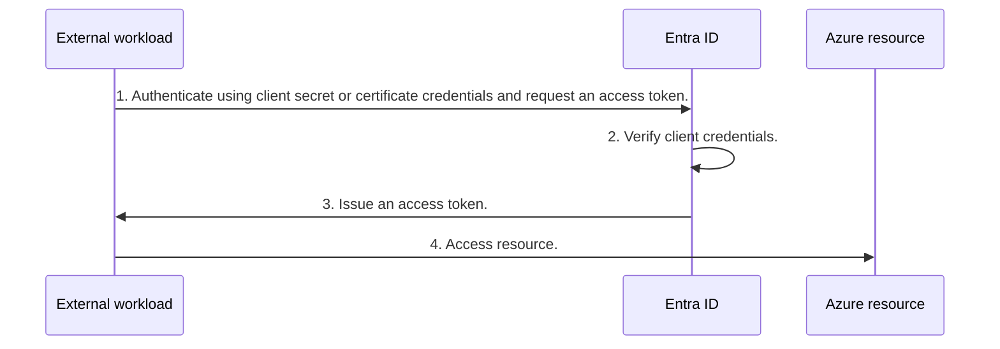
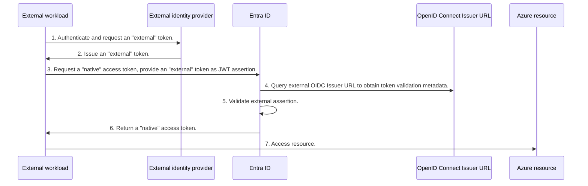
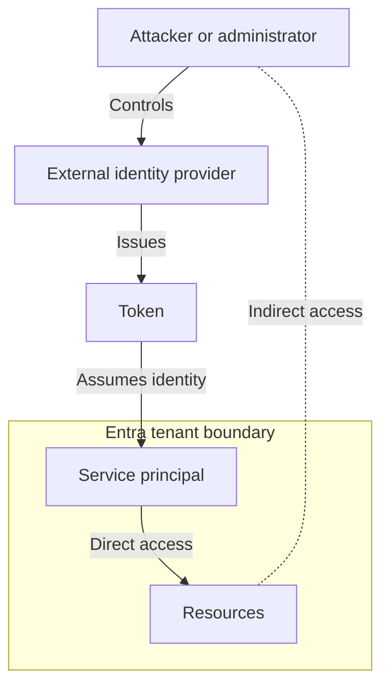

# Workload Identity Federation - great feature with some risks!

### Intro

The goal of this article is to present and explain implicit risks related to workload identity federation feature available in Entra ID and Azure infrastructure.<br>
The upsides of using it are well known and advertised. What's more difficult to find, is the summary of main risks attached to use of this technology.<br>
The rest of this article seeks to capture and describe these risks in a high-level fashion.

### What is workload identity federation?

To put it simply, it's an authentication and authorization mechanism for external workloads (i.e. GitHub Actions, Kubernetes clusters, third party Open ID Connect providers).<br>
It enables external workloads to assume the identity, privileges and access rights, of mapped Entra ID service principal or user-assigned managed identity. 

Traditionally, workload identity authentication from services external to Entra ID/Azure required use of client secrets or certificate credentials.


Workload identity federation enables you to eliminate operational tasks related to storage, secure handling in code and lifecycle management of authentication credentials.


This is a significant security advantage. However, you have to be aware that risks, which have been just eliminated, create new, sometimes implicit ones in other areas. 

### Overview of risks:

### **Risk #1 - software supply chain dependency and implicit identity-based attack paths**<br>
When you decide to use the workload identity federation, the authentication authority is shifted to an external identity provider (IdP), outside of your tenant boundary.<br>
Your Entra ID instance becomes a relying party, trusting the tokens issued by the external IdP.<br>
Reliance on external IdP creates a software supply chain dependency risk.<br> 
Effectively, you are trusting an external software to correctly authenticate an external entity which can assume privileges and access resources in your tenant.

To explain it further, consider following scenario:



Did you notice that whoever controls external identity provider, whether with malicious intent or not, possesses the capability to access resources in your tenant?

**How to assess it**:<br> 
Gauge the processes and technical controls applied to the external identity provider you are about to depend on.
Ask the following questions:
- What type of platform does the IdP run on? Is it self-hosted on-prem, self-managed IaaS, bespoke app code deployed in PaaS or cloud SaaS? Each platform bears different responsibilities for the teams accountable for its management.
- Who is accountable for management? Is it internal team responsible for managing Entra ID, different team inside your organization or is the accountability transferred to an external provider? Assess operational processes used manage the platform.
- What are the technical security controls applied to reduce the chances of misconfiguration. Do these controls follow an established security framework/benchmark or vendor best practices?

Ulitmately answer the question - based on the evidences you gathered and analysis you performed, is the resultant residual risk within the risk tolerance for your organization?

**Example mitigating control(s):** 
- Use vendor best practices to harden configuration of the external IdP (e.g. use phish-resistant authentication for privileged accounts, reduce the attack surface by turning off not required functionality).
- Employ robust operational processes (e.g. if on-prem or IaaS, PaaS - patch management, vulnerability management, for all architectures - identity lifecycle management, secured admistrative paths).
- Use least privilege when assigning permissions to a entity relying of workload identity federation (see risk #3).

**Potential impact if left unmitigated:**
- Compromise of external IdP leads to unauthorized access to all resources the federated workload identity had access to.

-------------------------

### **Risk #2 - Living off the land for persistence and data/resource access**<br>
Abuse of the legitimate, built-in platform features allowing attackers to obtain persistence in your tenant. 

**How to assess it:**<br>
To get the idea about the probability of this risk materializing, assess the current state of defensive measures and their robustness.
- How well do you protect the control plane roles (Directory - Global Admin, Application Admin, Cloud Application Admin; Infrastructure - Owner, User Access Administrator, Role Based Access Administrator and many others? Do you use just-in-time assignments? Does the elevation-to-role process require approvals?
- How robust is the policy enforcement engine (Entra ID: conditional access policies)? For critical-admin actions - do you require compliant devices? Phishing-resistant authentication? Require token-to-device cryptographic bindings? What about policies for workload (non-human) identities?
- How well do you control and vet permission consent grants for applications?

**Example compensating controls:**<br>
- A set of robust and effective processes is needed. As a preventative measure - employ a change management process, where each configuration will be vetted. Additionally, build an effective detection mechanism that responds and remediates every configuration change that doesn't have a match in the log of approved changes.
- Implement Azure Policies to apply governance to federated identity token issuers (applicable only for user-assigned managed identities in Azure infrastructure context). Example policies [here](https://www.azadvertizer.net/azpolicyadvertizer/2571b7c3-3056-4a61-b00a-9bc5232234f5.html), [here](https://www.azadvertizer.net/azpolicyadvertizer/fd1a8e20-2c4f-4a6c-9354-b58d786d9a1f.html) and [here](https://www.azadvertizer.net/azpolicyadvertizer/ae62c456-33de-4dc8-b100-7ce9028a7d99.html).
- Azure Policies can also block the use of workload identity federation at a designated scope (again, only for user-assigned managed identities in Azure infrastructure context). Details [here](https://learn.microsoft.com/en-us/entra/workload-id/workload-identity-federation-block-using-azure-policy).
- Minimize permanent assignments (use smart role elevation policies!) to the following Entra ID roles: Global Admin (that was obvious :)), Application Admin, Cloud Application Admin, Application Developer, any custom role with modify permissions iver application registrations and service principals. Do not assign any owners on app registration objects. Make sure that _Application.ReadWrite.All_ application permission is not assigned to any service principals/managed identities.
- Have robust detection and alerting capabilities.
  - Query to detect additions of federated identity credentials in application objects:
```
//set lookback period below
let lookback = 30d;
//query Entra ID audit logs for update application operations
AuditLogs
| where TimeGenerated > ago(lookback) and Category == "ApplicationManagement" and OperationName == "Update application"
| mv-apply TargetResources on (where TargetResources contains "FederatedIdentityCredentials")
| mv-apply AdditionalDetails on (where AdditionalDetails contains "AppId")
| project
    TimeGenerated,
    OperationName,
    ApllicationID = AdditionalDetails.value,
    Result,
    ActivityDisplayName,
    ConfigurationDetails = tostring(TargetResources.modifiedProperties[0].newValue)
| mv-expand todynamic(ConfigurationDetails)
```
  - Query to detect modification of federated identity configuration on user-assigned managed identities:
```
//set lookback period below
let lookback = 30d;
//query Azure Infrastructure audit logs for write operations on FederatedIdentityCredentials property
AzureActivity
| where TimeGenerated > ago(lookback) and OperationNameValue =~ "Microsoft.ManagedIdentity/UserAssignedIdentities/FederatedIdentityCredentials/Write" and ActivityStatusValue == "Success"
| extend AdditionalInformation = parse_json(Authorization)
| project TimeGenerated, EventSubmissionTimestamp,Caller, CallerIpAddress, Action = AdditionalInformation.action, Scope = AdditionalInformation.scope
```

**Impact if left unmitigated:**<br>
- Attackers living off the land and obtaining persistence by planting rouge federated credentials on highly privileged service principals.

-------------------------

### **Risk #3 - Absence of least privilege**<br>
Least privilege principle (one of the baseline pillars of any Zero Trust framework) not followed.

**How to assess it:**<br>
This is a general risk which applies in most of the environments and identity types.
- Check the permissions assigned to the service principal in your tenant. Most important places to check are: Entra ID roles, Azure RBAC roles, roles in SaaS workloads (Exchange Online, Microsoft Defender (both unified and workload-specific RBAC), Purview, 3rd party SaaS apps).
- Assess the permissions assigned against the permissions actually required to achieve a specific business or technical goal.

**Example mitigating control:**<br>
- Ensure robust assessment process that vet permissions thoroughly before consenting to and assigning them.<br> For example, if considering access to specific sites in SharePoint Online in Microsoft Graph, don't simply assign [Sites.ReadWrite.All](https://learn.microsoft.com/en-us/graph/permissions-reference#sitesreadwriteall), use [Sites.Selected or more granular scopes](https://learn.microsoft.com/en-us/graph/permissions-selected-overview?tabs=http#scopes) instead!

**Impact if left unmitigated:**<br>
- Greater that necessary impact to data assets in case of materialization of risks #2 and #3.

### Useful external resources:

- [Access cloud resources across Azure tenants without using secrets (Microsoft Entra Identity Platform Blog)](https://devblogs.microsoft.com/identity/access-cloud-resources-across-tenants-without-secrets/)
- [Workload Identity Federation (Microsoft Learn)](https://learn.microsoft.com/en-us/entra/workload-id/workload-identity-federation)
- [Identify and prevent abuse of Managed Identities with Federated Credentials from unauthorized entities (Thomas Naunheim)](https://www.cloud-architekt.net/identify-prevent-abuse-uami-fedcreds/)
- [Persisting on Entra ID applications and User Managed Identities with Federated Credentials (Dirk-jan Mollema)](https://dirkjanm.io/persisting-with-federated-credentials-entra-apps-managed-identities/)
- [Service Principal Insights (Julian Hayward)](https://github.com/JulianHayward/AzADServicePrincipalInsights)

-------------------------------------------------------------------------------------------
All work is licensed under a [Creative Commons Attribution 4.0 International License][cc-by].

[![CC BY 4.0][cc-by-image]][cc-by]

[cc-by]: http://creativecommons.org/licenses/by/4.0/
[cc-by-image]: https://i.creativecommons.org/l/by/4.0/88x31.png
[cc-by-shield]: https://img.shields.io/badge/License-CC%20BY%204.0-lightgrey.svg

